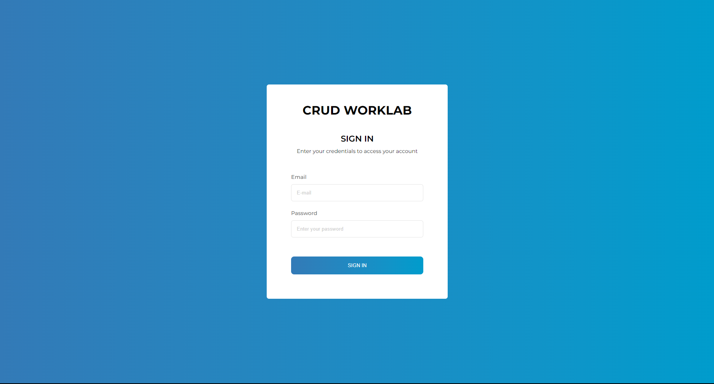
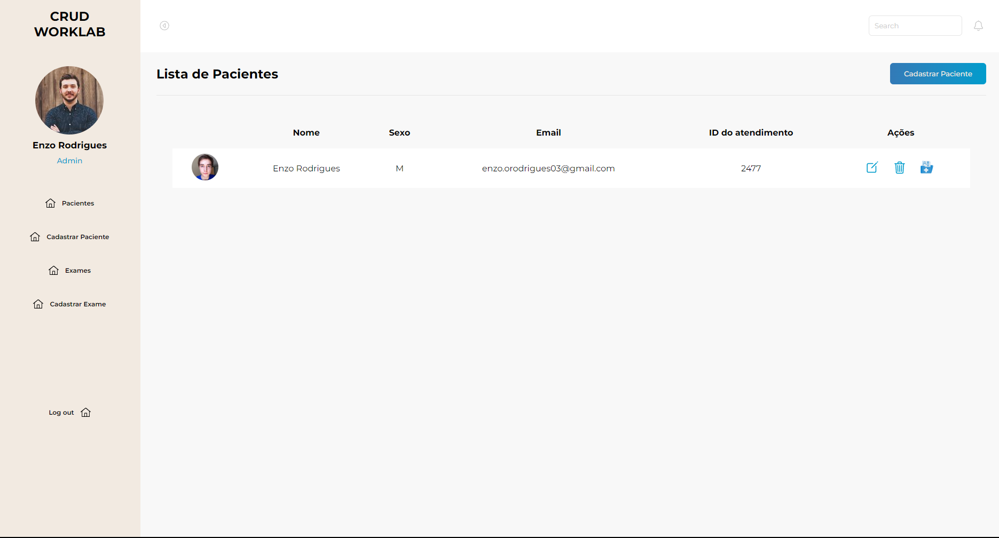

# WorkGest


Projeto desenvolvido com Express.js e MySQL, para o desafio da empresa Worklab. Esse projeto tinha como objetivo criar um sistema de gestão laboratorial, onde exames eram cadastrados e vinculados a atendimentos e geração de relatórios.

## Índice

- [Descrição](#descrição)
- [Protótipo](#protótipo)
- [Requisitos](#requisitos)
- [Setup](#setup)
- [Uso](#uso)

## Descrição

WorkGest é uma aplicação desenvolvida para atender ao desafio da empresa Worklab, focada na gestão de exames laboratoriais. O sistema permite o cadastro de exames, vinculação desses exames a atendimentos médicos, e a geração de relatórios detalhados. O objetivo é facilitar a gestão e organização dos processos laboratoriais, garantindo eficiência e precisão.

# Protótipo





## Requisitos

- Node.js
- MySQL

## Setup

Siga os passos abaixo para configurar e executar a aplicação:

1. **Clone o repositório:**

```bash
git clone https://github.com/seu-usuario/workgest.git
cd workgest

```

# Uso

Para iniciarmos o nosso projeto em localhost, será necessário iniacia-lo. Para fazer isso, basta digitar o seguinte comando em seu terminal:

` npm start` 

Agora que o servidor está rodando em sua máquina local, acesse a página de login no seu navegador. Na página de login, você encontrará um formulário para entrar na aplicação.

### Credenciais de Exemplo

Preencha os campos do formulário com qualquer informação, pois não há validação no banco de dados. Use as seguintes credenciais de exemplo:

- **Usuário:** [Seu usuário aqui]
- **Senha:** [Sua senha aqui]

Lembre-se, essas informações são apenas exemplos, pois a aplicação não realiza uma verificação real no banco de dados neste momento.

Após preencher os campos, clique no botão de login. Isso permitirá que você explore as funcionalidades da aplicação.


